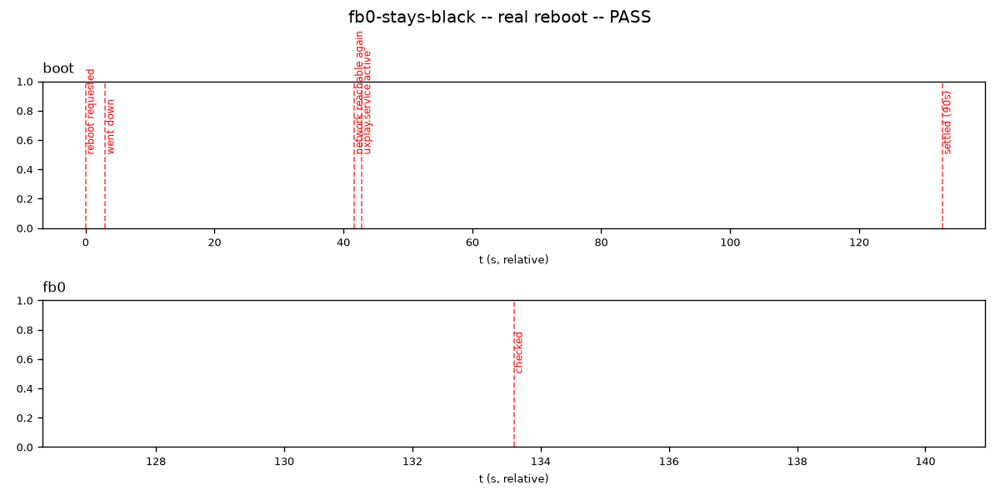

# `test_fb0_stays_black.py`

**Location:** `tools/pytest/test_fb0_stays_black.py`
**Stack:** e2e, **real Pi hardware**, real reboot (the only test in this
suite that reboots the device).
**Input:** none — checks the live device's actual `/dev/fb0`.

## Revisions tested

**None — no `uxplay_debug` ref applies.** Per the test's own docstring:
the bug lives in `image-builder/files/` (the `zero-fb0` script,
`uxplay.service`'s `ExecStartPre`) and `customize-boot.sh`
(`cmdline.txt`/`config.txt`), not in the server binary — there's no
"before/after commit" to build and compare here. This test only makes
sense run once, against whatever image is currently flashed on the real
device. Ran it for real, against the currently-flashed image, rather than
constructing a before/after narrative that doesn't apply to this class of
bug.

## Result — PASS, real reboot

```
tools/pytest/test_fb0_stays_black.py::test_fb0_stays_black_through_real_boot
PASSED [134.33s]
```



**Interpretation:** a real boot timeline, not a simulation -- reboot
requested at t=0.7s, device off the network by t=3.8s, back on the
network at t=42.4s (~39s of actual downtime), `uxplay.service` active a
second later (43.6s), then a deliberate 90s settle window (per the test's
own `SETTLE_S`, generous margin for late console/cursor activity on a Pi
3B+) before checking `/dev/fb0` at t=134.3s. The check itself:
`cmp /dev/fb0 /dev/zero` returned `EOF on /dev/fb0 after byte 4147200, in
line 1` with no `differ` anywhere in the output -- meaning every one of
those 4,147,200 bytes (the framebuffer's full readable extent) compared
identical to zero. Genuinely zeroed, not just "no error printed".

## Verdict

Legitimate test, different category from every other one in this suite
(boot-image bug, not a `uxplay_debug` behavior) -- the before/after-commit
report structure this file follows for the other tests doesn't apply to
it at all, and that's not a shortcoming of the test. Not a deletion
candidate.
