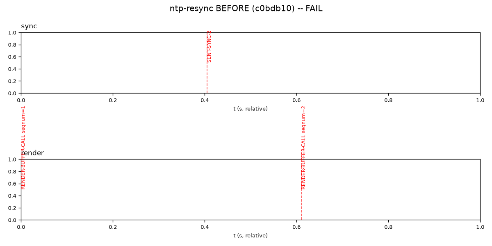
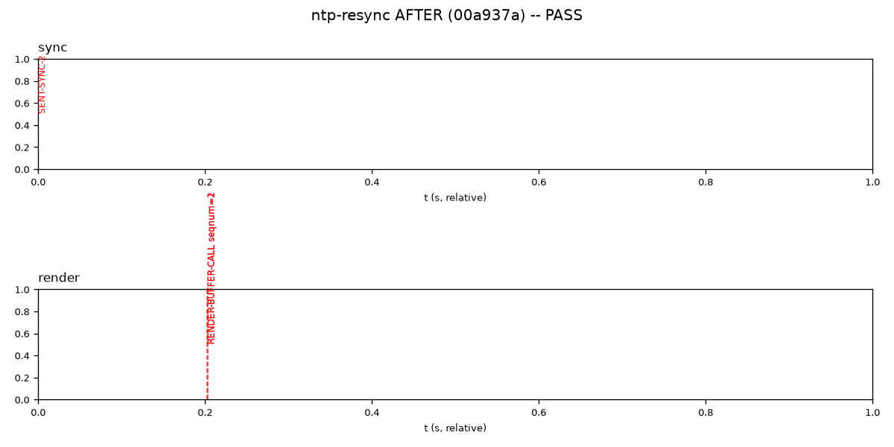

# `test_ntp_resync.py`

**Location:** `tools/pytest/test_ntp_resync.py`
**Stack:** e2e, Docker-only (no Pi) — `two_process_runner` fixture starts an
unmodified `uxplay_debug` and `tools/synthetic-client.cpp`'s `ntpresync` mode
as two separate processes in one container.
**Input:** no fixture files — `synthetic-client` builds its RTSP/RTP traffic
in-process from a real, captured AAC-ELD frame baked into its own source.

## Revisions tested

- **Before:** UxPlay `dhabensky-clean` commit `c0bdb10` ("Add -threadtest
  diagnostic instrumentation to the audio renderer") — has the
  `RENDER-BUFFER-CALL` diagnostic the test parses, but not yet the fix.
- **After:** UxPlay `dhabensky-clean` commit `00a937a` ("Fix audio dying
  permanently after a repeated audio SETUP on a connection") — the very next
  commit, containing only the isolated behavioral fix
  (`lib/raop_rtp.c`'s `raop_rtp_start_audio()` reset + a companion
  `audio_renderer.c` base-time refresh on same-codec restart).

Note on why "before" isn't the fix's direct git parent: the original,
un-curated commit bundled the diagnostic instrumentation into the same
commit as the fix (an "instrumentation born with the fix" pattern found
across several commits in this fork's real history). Running against that
commit's parent produced a `driver did not complete` failure for the wrong
reason — no `RENDER-BUFFER-CALL` output existed *at all* yet, fix or no fix.
Split into two commits on `dhabensky-clean` specifically so a valid
apples-to-apples boundary exists: `c0bdb10` has every diagnostic marker this
test needs, `00a937a` adds only the fix on top.

Reproduce: `tools/pytest/.venv/bin/pytest tools/pytest/test_ntp_resync.py
--uxplay-ref c0bdb10` (expect FAIL) vs `--uxplay-ref 00a937a` (expect PASS).

## Before (`c0bdb10`) — FAIL

```
AssertionError: probe A rendered at t=118274.8593 BEFORE the second sync
(t=118275.2645) -- stale sync state wasn't reset on restart
```



**Interpretation:** the picture is the whole story in one glance. The
`render` track's `RENDER-BUFFER-CALL seqnum=1` marker sits at t=0.0 (the
very first event in the trace), a full ~0.41s *before* the `sync` track's
`SENT-SYNC-2` marker. Probe A (`seqnum=1`) was sent deliberately *before*
any fresh sync packet, specifically to land in the exact window the bug
lives in — and it rendered immediately anyway, using the stale
RTP-timestamp-to-NTP mapping left over from the *first* sync (sent before
the TEARDOWN+SETUP restart on this connection). `seqnum=2` (probe B, sent
*after* the fresh sync) renders correctly, ~0.2s after `SENT-SYNC-2` — so
this isn't "nothing ever renders," it's specifically the restart's
cold-start guard failing to actually reset, exactly as documented.

## After (`00a937a`) — PASS



**Interpretation:** `SENT-SYNC-2` now sits at t=0.0 (it's the earliest event
in this trace — probe A's render no longer preempts it), and *both*
`RENDER-BUFFER-CALL` markers land together at t≈0.2s, ~137 microseconds
apart (indistinguishable at this plot's scale, which is itself informative:
the raw JSON confirms two nearly back-to-back renders, not a hang). Reading
the raw trace directly: `seqnum=1` at server-uptime 118292.331838, `seqnum=2`
at 118292.331975 — both **after** `SENT-SYNC-2` (118292.128979). Probe A was
genuinely withheld until the fresh sync arrived, then released promptly
along with probe B, matching the fix's documented intent exactly.

## Verdict

Real bug, real fix, real before/after boundary — no caveats. Confirms the
fix's core claim (stale sync state reset on restart) with a picture that
needs no supporting narrative to read correctly.
