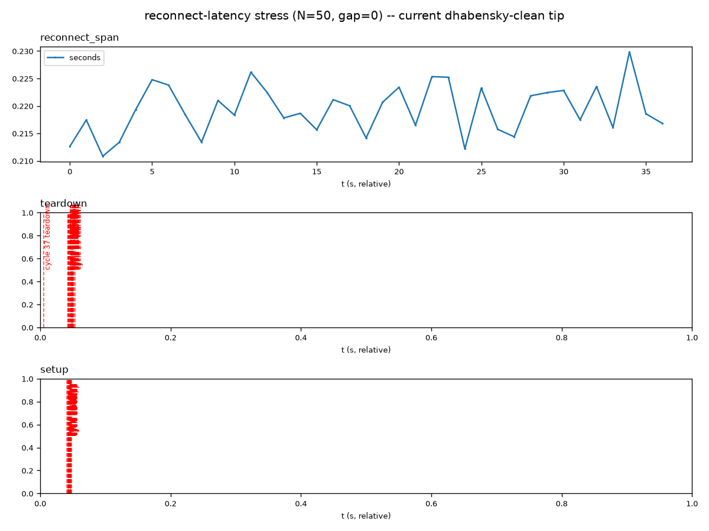
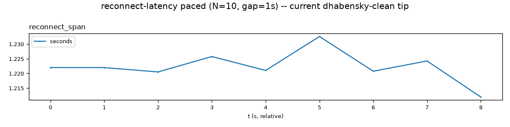

# `test_reconnect_latency.py`

**Location:** `tools/pytest/test_reconnect_latency.py`
**Stack:** e2e, Docker-only (no Pi) — `two_process_runner` fixture,
`synthetic-client threadtest N --gap-s S`.
**Input:** none — synthetic RTSP/RTP traffic only.

## Revisions tested

**None — this test has no single "the bug".** It's an exploratory stress
test by design (its own docstring: "hunts for a slow outlier across many
more cycles than one real capture shows"), always run against whatever's
current. There is no fix commit to bisect against and no meaningful
"before" state to demonstrate — flagged as such rather than forcing a
before/after narrative that doesn't fit. Run once, for real, against
current `dhabensky-clean` tip (`a932acc`) to confirm the two-process
migration didn't change its actual numbers.

## Result — both PASS, current tip

```
tools/pytest/test_reconnect_latency.py::test_reconnect_latency_stress PASSED
tools/pytest/test_reconnect_latency.py::test_reconnect_latency_realistic_pacing PASSED
```

### Stress run (N=50, gap=0s)



**Interpretation:** the `reconnect_span` track (the one that actually
matters) shows 50 cycles bouncing between ~0.211s and ~0.230s with no
outlier anywhere near the 0.5s threshold — consistent, boring, exactly what
a passing stress run should look like. The `teardown`/`setup` tracks below
it are visually uninformative in this rendering: the test's own code plots
each cycle's round-trip *duration* (a small number, ~0.05-0.1s) as if it
were the event's x-axis time, not a real wall-clock position, so all 50
cycles' markers cluster at the left edge regardless of which cycle they're
from. Not a bug in the test's actual pass/fail logic (that's computed from
the underlying dict, not the picture), just a rendering quirk worth being
honest about rather than presenting as more informative than it is.

### Realistic-pacing run (N=10, gap=1s)



**Interpretation:** `reconnect_span` lands at ~1.21-1.23s across 10 cycles
-- almost exactly (1s gap + the stress run's ~0.22s mean), which is the
one thing this run exists to confirm per its own docstring (a sanity check
that the zero-gap stress numbers are representative, not a THRESHOLD_S
assertion). It checks out.

## Verdict

**Not a candidate for deletion, but not "proof of a fix" material either**
-- genuinely useful ongoing regression coverage (an outlier here would be
worth investigating even with no specific bug in mind), reported honestly
as exploratory rather than dressed up with a before/after it doesn't have.
