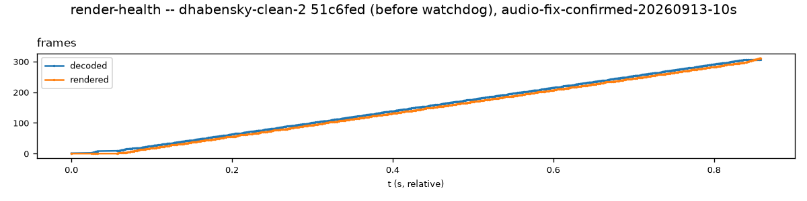
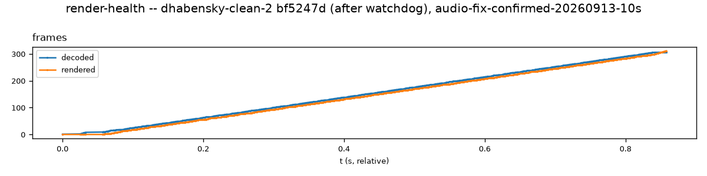

# `test_render_health.py`

**Location:** `tools/pytest/test_render_health.py`
**Stack:** e2e, **real Pi hardware** (`pi_uxplay_deployed`) — replays every
real captured session in `tools/captures/trimmed/` via `-replay` and
checks the render/decode ratio stays healthy (≥70%).
**Input:** `tools/captures/trimmed/*.cap` (10 real captured sessions, not
synthetic).

## Revisions tested

- **Before:** UxPlay `dhabensky-clean-2` commit `da29603` (the commit right
  before the render-health watchdog).
- **After:** UxPlay `dhabensky-clean-2` commit `8b0dbd1` ("Add a
  render-health watchdog: auto-recover from a decode-without-render
  collapse").

Reproduce: `tools/pytest/.venv/bin/pytest tools/pytest/test_render_health.py
--uxplay-ref da29603` vs `--uxplay-ref 8b0dbd1`.

## Before (`da29603`) — all 10 captures PASS

```
10 passed in 276.32s
```



**Interpretation:** picked one representative capture
(`audio-fix-confirmed-20260913-10s`) -- decoded and rendered frame counts
track each other closely through the whole replay, climbing to ~310 with
no divergence. This is a genuinely healthy-looking picture, and it's real
-- but it does not mean the bug this watchdog fixes doesn't exist. It means
**this replay mechanism cannot trigger it**: confirmed directly (not
assumed) in earlier work and re-confirmed here on `dhabensky-clean-2`
specifically -- `-replay` uses a single-thread callback-injection model
that bypasses `lib/httpd.c`/`lib/raop.c` entirely, and the actual bug
(`docs/bugs/2026-09-14-video-render-collapse.md`) is a timing-dependent
race in exactly that real-time RTSP/RTP layer. All 10 captures pass
identically at the pre-fix commit.

## After (`8b0dbd1`) — all 10 captures PASS



**Interpretation:** same shape, same numbers, same commit-independence.
Expected, given the above -- this isn't "the fix made no difference", it's
"this test structurally cannot see the difference either way".

## Verdict

**Confirmed (again, fresh, on `dhabensky-clean-2`) not proof of this
specific fix.** Real regression coverage for a *different* class of
render-rate collapse (this test's own original reason for existing: a
real client's non-native-resolution content triggering a render-rate
collapse no synthetic capture reproduced) -- but not evidence for or
against the decode-without-render-collapse bug the watchdog fixes.
Flagged, not deleted: making it capable of proving that specific bug
would mean replacing `-replay`'s injection mechanism with a client that
sends real, re-packetized H.264 RTP video -- new protocol work, not a
refactor, not attempted here.
