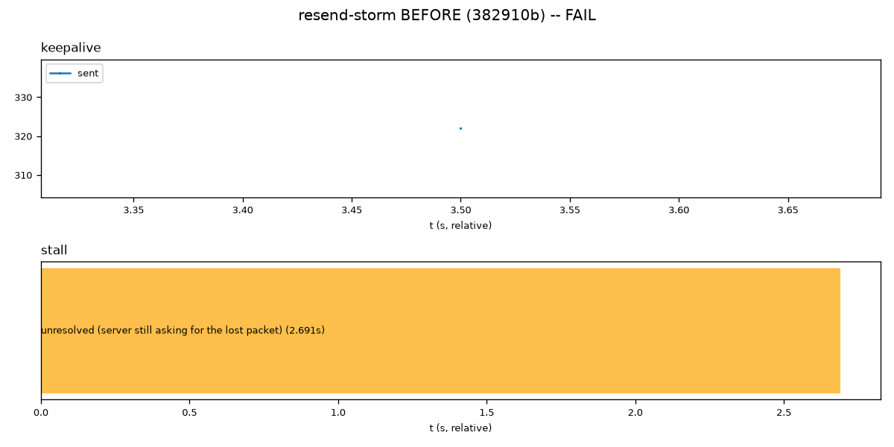
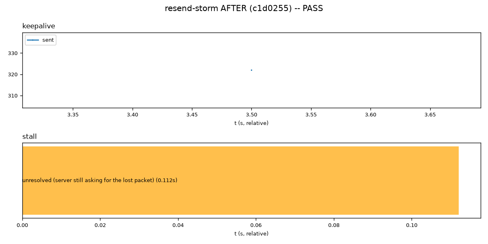

# `test_resend_storm.py`

**Location:** `tools/pytest/test_resend_storm.py`
**Stack:** e2e, Docker-only (no Pi) — `two_process_runner` fixture, same
unmodified-server + separate-client-process model as `test_ntp_resync.py`.
**Input:** no fixture files — `synthetic-client resendstorm` builds a
permanent 3-packet gap (seqnum 5-7, never sent) then feeds keepalive
packets at AAC-ELD's real ~10.9ms cadence for 3.5s, counting resend
requests from the server on its own bound control socket.

## Revisions tested

- **Before:** UxPlay `dhabensky-clean` commit `382910b` ("Fix two -mp4
  mux-to-file bugs...") — the commit immediately before the stall-timeout
  fix; `lib/raop_buffer.c` still only has the resend-*request*-rate-limit
  fix (previous commit), not the actual stall-duration fix.
- **After:** UxPlay `dhabensky-clean` commit `c1d0255` ("Add stall-timeout
  force-skip: the fix that actually bounds the ~2.8s dropout") — adds
  `RAOP_STALL_TIMEOUT_NS`, a time-based force-skip independent of the
  buffer's capacity-based one.

This pair needed no splitting: `c1d0255`'s only `uxplay.cpp` content (an
AAC-ELD cadence-tuning constant for the old in-process `-resendstormcheck`
driver) was already dropped wholesale when the driver was extracted into
`tools/synthetic-client.cpp` (a fixed constant, not diagnostic
instrumentation the test depends on) — nothing left to entangle.

Reproduce: `tools/pytest/.venv/bin/pytest tools/pytest/test_resend_storm.py
--uxplay-ref 382910b` (expect FAIL) vs `--uxplay-ref c1d0255` (expect PASS).

## Before (`382910b`) — FAIL

```
AssertionError: stall took 2.691s to resolve (limit 0.3s) -- this is the
~2.8s dropout docs/bugs/2026-09-14-audio-resume-latency-on-seek.md describes
```



**Interpretation:** the `stall` bar spans the full width of its own
0.0-2.7s axis, labeled "unresolved (server still asking for the lost
packet) (2.691s)" — the server kept re-requesting the missing packet for
2.691 real seconds before giving up and force-skipping past it, landing
almost exactly on the ~2.8s figure the bug doc independently measured from
a real capture. The `keepalive` track's single point (322 packets sent by
the end of the 3.5s window) confirms the client kept feeding traffic
throughout — this wasn't a starved/idle test, the server just kept asking
for a packet it was never going to get for that whole span.

## After (`c1d0255`) — PASS



**Interpretation:** same bar, same visual width (each subplot's x-axis
auto-scales independently — don't read the two pictures' bar widths against
each other, read the numbers in their labels), but now labeled "(0.112s)"
-- the number that actually matters. 2.691s → 0.112s is a ~24x cut,
consistent with the fix's own commit message ("~27x improvement" measured
separately in Docker). The `keepalive` track shows the identical 322-packet
send pattern as the before run (same synthetic-client behavior both times,
confirming the client side is unchanged and the difference is genuinely the
server's), so the only variable that moved is the fix itself.

## Verdict

Real bug, real fix, real before/after boundary, no caveats. One honest
weakness in the *evidence*, not the fix: the `keepalive` counter track is a
single end-of-window summary point (`add_counter` is called once, not
sampled over time, in the test's own code) — informative as a sanity check,
not as a real time series. The `stall` duration bar is what actually proves
the fix; the counter track is secondary.
