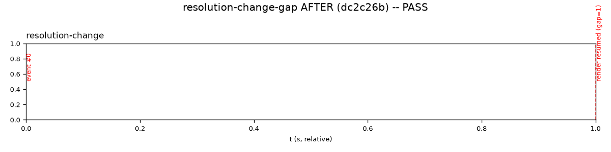

# `test_resolution_change_gap.py`

**Location:** `tools/pytest/test_resolution_change_gap.py`
**Stack:** e2e, **real Pi hardware** (`pi_uxplay_deployed`) — replays a 1s
fixture via `-replay` and measures how many frames decode before
`kmssink` resumes rendering after the one normal mid-stream
resolution-change renegotiation every real session goes through.
**Input:** `tools/captures/resolution-change-gap-repro.cap` (committed
fixture, a 1s trim of a real capture).

## Revisions tested

Same pair as `test_render_health.py` (same underlying watchdog fix, same
`-replay` mechanism): **before** `c1d0255`, **after** `dc2c26b`.

Reproduce: `tools/pytest/.venv/bin/pytest
tools/pytest/test_resolution_change_gap.py --uxplay-ref c1d0255` vs
`--uxplay-ref dc2c26b`.

## Before (`c1d0255`) — PASS

```
1 passed in 15.38s
```

Log (`build/logs/resolution-change-gap.log`): `Received resolution
change` fires, `Handling frame` continues for exactly 1 more frame, then
`gst_kms_sink_import_dmabuf` fires -- render resumed with gap=1 frame,
comfortably under `MAX_GAP_FRAMES=10`.

## After (`dc2c26b`) — PASS



**Interpretation:** identical gap=1 result at both commits (the picture
itself is only marginally useful here -- two markers near the edges of a
frame-index axis with just one fixture and one event per run, not much
to visualize; the log line honestly carries more information than the
plot for this specific test). Same root cause as
`test_render_health.py`'s finding, re-confirmed independently on this
fixture: `-replay` never reaches the real-time RTSP/RTP layer the actual
collapse bug lives in, so a pre-fix and post-fix binary produce the same
result here.

## Verdict

Same category as `test_render_health.py` -- real, useful regression
coverage for the resolution-change renegotiation gap staying small (the
thing it was actually built to check, including proving `-bt709` doesn't
help, `docs/bugs/2026-09-14-video-render-collapse.md`), but not capable
of demonstrating the render-health watchdog fix specifically, for the
same structural reason. Not a deletion candidate.
