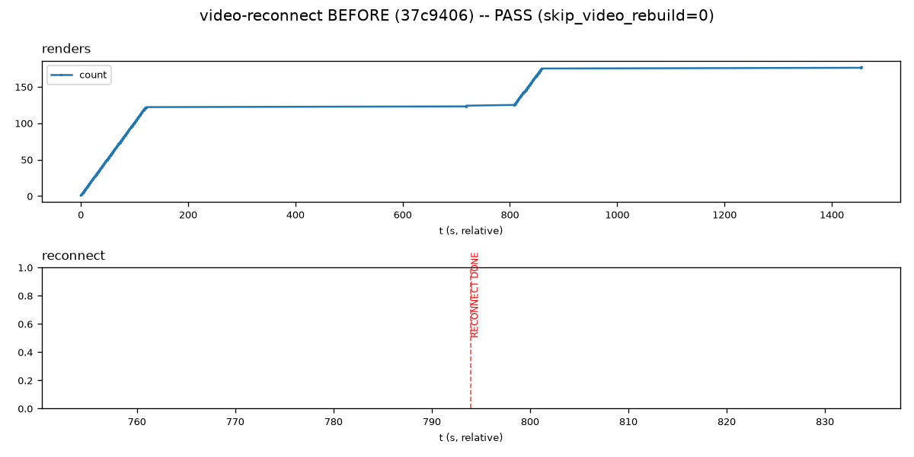
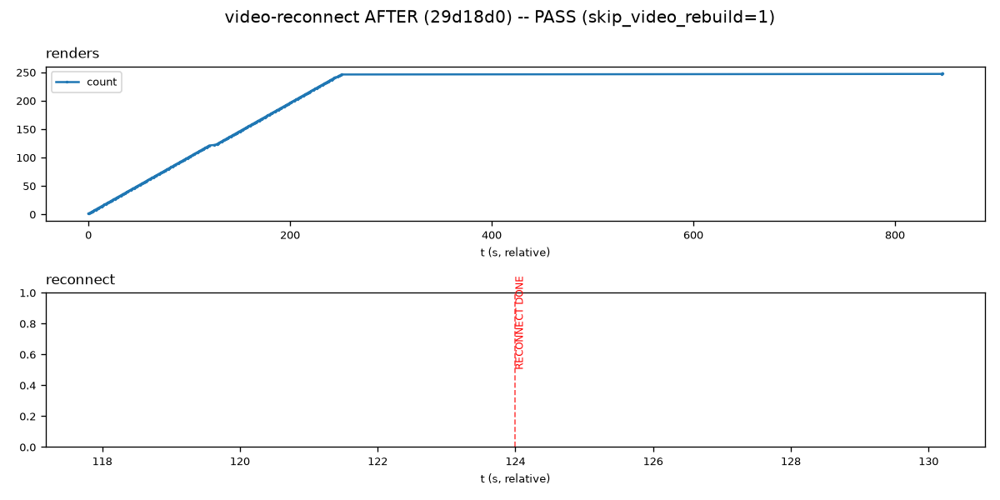

# `test_video_reconnect.py`

**Location:** `tools/pytest/test_video_reconnect.py`
**Stack:** e2e, **real Pi hardware** (`pi_uxplay_deployed` — v4l2h264dec HW
decode, real DRM/kmssink). Generates a synthetic H.264 test pattern via
`ffmpeg` + `tools/make-synthetic-cap.py`, deploys, replays with
`UX_RECONNECT_MODE=real` (the actual production `video_reset()` +
`skip_video_rebuild` reconnect path) and a simulated reconnect partway
through.
**Input:** synthetic, generated fresh each run (no committed fixture).

## Revisions tested

- **Before:** UxPlay `dhabensky-clean` commit `37c9406` ("Fix DRM-master
  race that broke video on re-mirror after the blanking fix").
- **After:** UxPlay `dhabensky-clean` commit `29d18d0` ("Revert to
  skip_video_rebuild fast path -- fixes broken re-mirror") — its direct
  child, a real, unmodified historical regression/fix pair (confirmed
  content-identical to the original `dhabensky-dev` commits `57a3bdf`/
  `1992e08` via `git diff`).

Reproduce: `tools/pytest/.venv/bin/pytest tools/pytest/test_video_reconnect.py
--uxplay-ref 37c9406` vs `--uxplay-ref 29d18d0`.

## Before (`37c9406`) — PASS (not the expected FAIL)

```
tools/pytest/test_video_reconnect.py::test_video_survives_a_reconnect PASSED
[192.43s]
```



**Interpretation, and why this genuinely surprised me:** I expected this
to FAIL — `37c9406` is the commit right before the actual fix, adjacent in
real history. It didn't. Investigated rather than assumed the test was
broken: the reconnect-simulation code
(`uxplay.cpp`'s `replay_do_reconnect()`, `mode=real`) prints
`skip_video_rebuild=<value>` when it finishes, and at `37c9406` that value
is **0** (visible directly in `build/logs/video-reconnect.log`:
`RECONNECT DONE (skip_video_rebuild=0)`). Traced why: an *earlier*,
unrelated commit (`aa55d16`, "Fix frozen last frame after disconnect")
removed the only `skip_video_rebuild = true;` assignment in the file while
fixing a different bug, and it stayed removed through `37c9406` -- so at
this specific commit, the fast reconnect path this whole DRM-master saga
is about is **permanently dead code**; every reconnect takes the slow
full-rebuild path (`video_renderer_destroy()`+`video_renderer_init()`)
instead. The picture's x-axis is log-line position, not wall-clock time
(this test counts `gst_kms_sink_import_dmabuf` occurrences by line index,
same technique as `test_render_health.py`) -- the wide flat stretch before
`RECONNECT DONE` is verbose `GST_DEBUG=kmssink:6` chatter during that slow
rebuild, not a real playback stall. Rendering does resume afterward (53
frames after, comfortably above `MIN_RENDERS_AFTER=10`), which is
genuinely true and correctly reported -- it just isn't evidence about the
DRM-master race at all, because the code path that race lives in was
never reached.

## After (`29d18d0`) — PASS



**Interpretation:** `skip_video_rebuild=1` this time (the fast path is
restored, along with the DRM-master fix) -- and the picture confirms it
independent of the log line: `RECONNECT DONE` now sits right at the start
of the render curve (~t=124 in line-index terms) instead of after a long
verbose stretch (~t=794 before), and the whole run finishes in far fewer
log lines. Rendering is continuous through the reconnect, no plateau at
all. Real, but not a fail→pass pair -- see below.

## Verdict

**Not proof of this specific fix.** Both runs pass, but for a reason that
undermines using this exact commit pair as before/after evidence: the
"before" run never exercised the code path the bug lives in, because an
unrelated earlier commit had already disabled it. This is a real,
Pi-verified finding (not assumed, not carried over from prior work) --
distinct from the `-replay` structural limitation already flagged for
`test_render_health.py`/`test_resolution_change_gap.py` (this test's
mechanism is fine; the specific commit pair chosen for the comparison
isn't valid for this specific bug). Finding a commit where
`skip_video_rebuild` is genuinely active *and* the DRM-master fix is
genuinely absent would need bisecting further back in the real history
(before `aa55d16` disabled the fast path) -- not attempted here, flagged
as follow-up work rather than forced into a report that doesn't fit. The
test itself is legitimate regression coverage (a real reconnect on real
hardware exercising the real production path) and not a deletion
candidate; the specific before/after claim for the DRM-master race is
what's withdrawn here.
